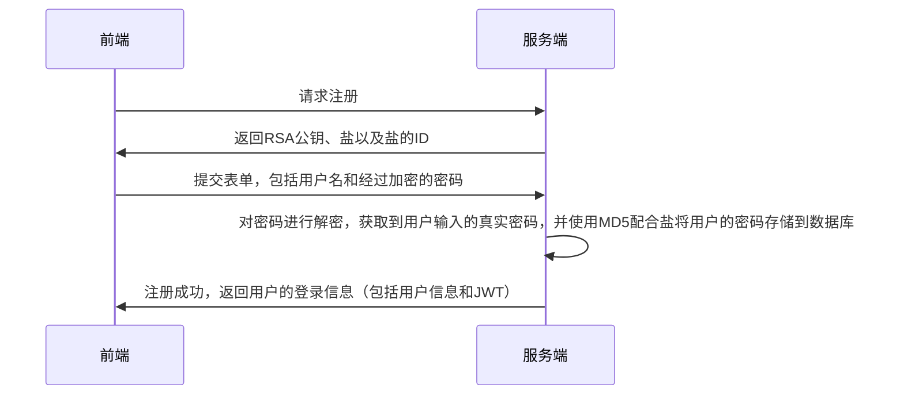
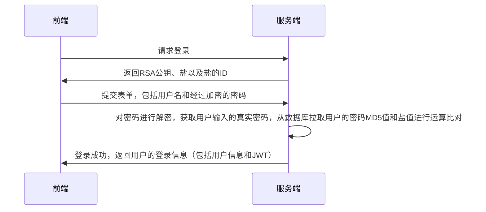

# MVP 版本

MVP 版本指一个软件的最小可用版本，在这个项目中，完成 MVP 版本需要实现以下两点内容：

- 用户注册、登录

- 用户身份校验

- 即时通讯 IM

# 技术选型

- Web：React、Material UI、Recoil。

- WebSocket: Socket.io + node.js

- Server: Go

上述三个服务最终会通过 Nginx 串联起来，最终构成一个非常常见的单体应用。

# 技术文档

## 注册和登录

### 数据建模

Linkme 的定位是一个提供给用户使用的内容托管平台，所以用户的概念是不可缺少的，在 MVP 版本，我拟定了一个最小化的用户数据模型：

```go
type User struct {
  gorm.Model

  Username string
  Password string
  Salt string

  AvatarUrl *string
}
```

因为不能在数据库中明文存储用户密码，这里在用户数据中额外插入了一条数据 Salt，用来表明在进行加密操作时使用的盐。

### 流程图

注册功能流程图如下所示：



登录功能的流程图如下所示：


