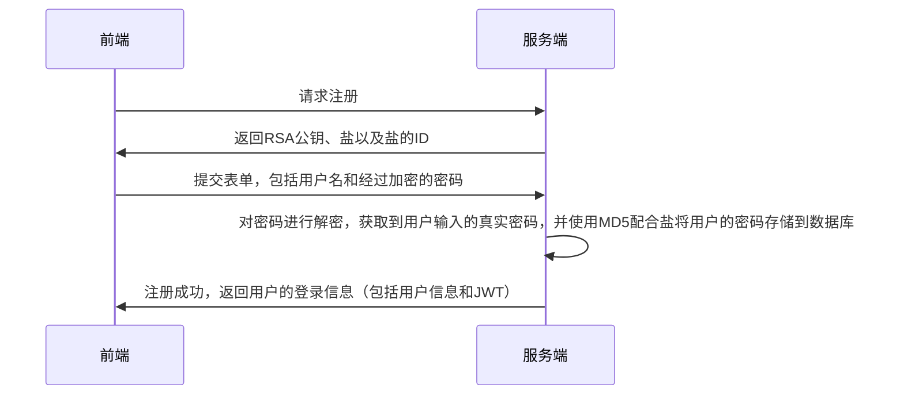
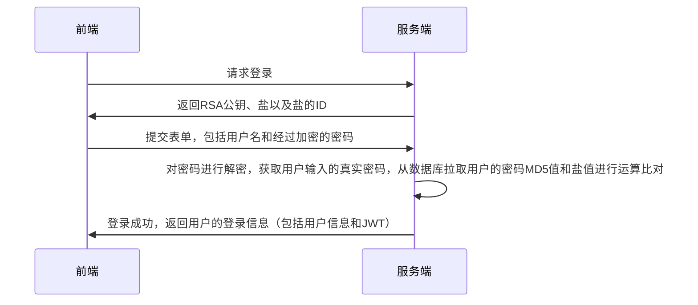

# MVP 版本

MVP 版本指一个软件的最小可用版本，在这个项目中，完成 MVP 版本需要实现以下两点内容：

- 用户注册、登录

- 用户身份校验

- 即时通讯 IM

# 技术选型

- Web：React、Material UI、Recoil。

- WebSocket: Socket.io + node.js

- Server: Go

上述三个服务最终会通过 Nginx 串联起来，最终构成一个非常常见的单体应用。

# 技术文档

## 注册和登录

### 数据建模

Linkme 的定位是一个提供给用户使用的内容托管平台，所以用户的概念是不可缺少的，在 MVP 版本，我拟定了一个最小化的用户数据模型：

```go
type User struct {
  gorm.Model

  Username string
  Password string
  Salt string

  AvatarUrl *string
}
```

因为不能在数据库中明文存储用户密码，这里在用户数据中额外插入了一条数据 Salt，用来表明在进行加密操作时使用的盐。

### 流程图

注册功能流程图如下所示：



登录功能的流程图如下所示：



## 即时通讯 IM

### 数据建模

在最简单的即时通讯中，进行数据建模时，关键的数据类型有以下几个：

- 会话 `Conversation`

- 会话成员 `Member`

- 会话信息 `Message`

用户会以会话为核心，以会话成员的身份为中介，使用会话信息与其他成员进行信息的传递和交流。

基于这条线索，我们可以很快的推断出这三个模型与之前定义的用户模型之间的从属关系。

上面这三个数据模型的定义实现了用户与会话之间的交互能力，但为了优化用户在使用 IM 时的交互体验，我们还需要构建下面两个数据模型：

- 会话列表 `SequenceItem`

  在通常的 IM 应用中，通常会提供一个会话列表向用户展示未读信息和最近开启的会话，通过定义会话列表项的数据模型来实现这一功能。

- 消息接收者 `MessageReciver`

  为了实现消息已读人数的展示功能，我们需要在创建消息的时候一并创建应当接受这条消息的用户，从而实现已读用户的数量展示。

### 消息推送

即时通讯应用通常需要保证用户能看到最新的消息，为了实现这一功能，我们这里使用 Socket.io + Koa 的 Node.js 应用来构建前端与服务端之间的长连接，从而实现服务端的消息推送能力。

上面的解法会导致整个程序面对下面两个问题：

- 如何实现 Socket 服务和服务端之间的通信？

  Socket 服务和服务端之间的服务通信会通过文件系统的能力来解决，因为项目最后会使用 Docker Compose 部署到云服务器上，所以可以通过修改 Volumns 配置项来保证 Socket 服务和服务端能够拿到同一份秘钥文件，通过在请求头中附加这个秘钥文件的内容，两个服务之间就可以认识到这个请求是来自内部服务的请求。

  当然这个解决办法只是暂时的，如果后期需要使用 Redis 进行数据缓存的话，可以通过 Redis 作为两个服务间的第三方来提供服务间鉴权数据的存储。

- 如何设计 Socket 服务的推送事件？

  目前针对 Chat 服务主要设计的推送事件有以下几个：

  - `SequenceItem` 更新用户的会话信息，客户端通过这个时间向服务端请求所有的会话信息，服务端通过这个事件向客户端推送会话信息。

  - `ConversationMessage` 客户端发起该事件时，会拉取会话中指定位置的 50 条信息，不附加参数的话会默认定位到以用户已读的最新信息，否则需要通过`loadNew`或`loadOld`指定加载信息的方向，并指定`pointMessageId`来声明新加载信息根据哪一条信息开始计算位置，服务端发起该事件时，会将`Message`信息传递给客户端。

  - `CheckMessage` 消息已读事件，客户端发起这个事件的时候会向服务端附带一条 Message 的 ID，服务端会根据 MessageId 和用户 Id 索引到消息接收者 Model，然后将用户对这条消息的已读状态设置为 true，同时变更对应 Message 中的已读人数，在通过`ConversationMessage`事件将变化的 Message 数据推送给客户端以修改 View 层。

  通过上面三个事件，基本就已经能完成大部分在即时通讯应用中的消息推送需求，而对于一些诸如创建会话、搜索用户之类的能力，则通过普通的 Http 请求来实现，以降低 Socket 负载。

### 需求分解

IM 应用整体来说算是一个比较大的部分，为了保持良好的开发节奏，需要对这个需求按用户能触及的功能点进行进一步的拆解：

- 创建会话

  - 创建一对一会话

    - 搜索用户

  - 创建群组会话

    - 添加群组会话初始化表单

- 进入会话

  - 拉取会话信息

  - 以会话为单位接受信息推送

- 发送信息

  - 为对应的会话创建信息

  - 在创建信息的过程中使用事务同时添加信息的接收者

- 阅读信息

  - 通过 `IntersectionObservable` 类实现消息的阅读，并通过 `CheckMessage` 事件告知服务器用户已读信息。
