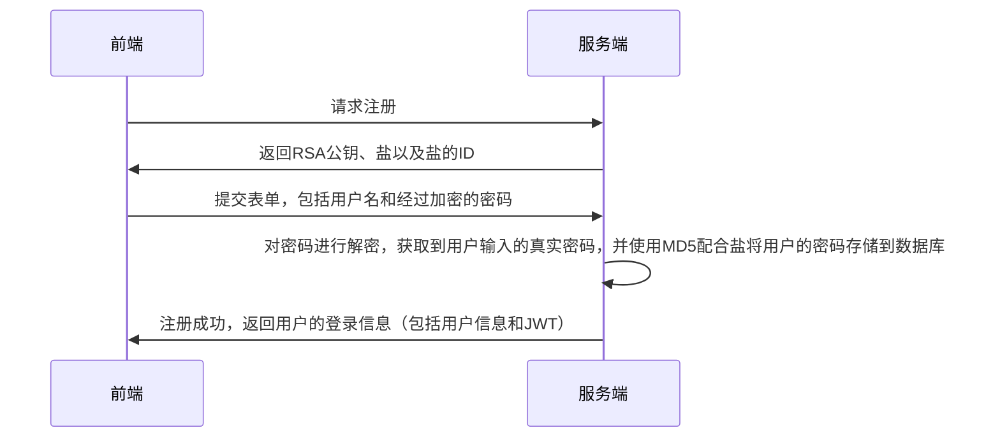
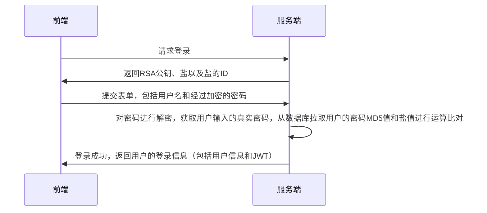

# MVP 版本

MVP 版本指一个软件的最小可用版本，在这个项目中，完成 MVP 版本需要实现以下两点内容：

- 用户注册、登录

- 用户身份校验

- 即时通讯 IM

# 技术选型

- Web：React、Material UI、Recoil。

- WebSocket: Socket.io + node.js

- Server: Go

上述三个服务最终会通过 Nginx 串联起来，最终构成一个非常常见的单体应用。

# 技术文档

## 注册和登录

### 数据建模

Linkme 的定位是一个提供给用户使用的内容托管平台，所以用户的概念是不可缺少的，在 MVP 版本，我拟定了一个最小化的用户数据模型：

```go
type User struct {
  gorm.Model

  Username string
  Password string
  Salt string

  AvatarUrl *string
}
```

因为不能在数据库中明文存储用户密码，这里在用户数据中额外插入了一条数据 Salt，用来表明在进行加密操作时使用的盐。

### 流程图

注册功能流程图如下所示：



登录功能的流程图如下所示：



## 即时通讯 IM

### 数据建模

在最简单的即时通讯中，进行数据建模时，关键的数据类型有以下几个：

- 会话 `Conversation`

- 会话成员 `Member`

- 会话信息 `Message`

用户会以会话为核心，以会话成员的身份为中介，使用会话信息与其他成员进行信息的传递和交流。

基于这条线索，我们可以很快的推断出这三个模型与之前定义的用户模型之间的从属关系。

上面这三个数据模型的定义实现了用户与会话之间的交互能力，但为了优化用户在使用 IM 时的交互体验，我们还需要构建下面两个数据模型：

- 会话列表 `SequenceItem`

  在通常的 IM 应用中，通常会提供一个会话列表向用户展示未读信息和最近开启的会话，通过定义会话列表项的数据模型来实现这一功能。

- 消息接收者 `MessageReciver`

  为了实现消息已读人数的展示功能，我们需要在创建消息的时候一并创建应当接受这条消息的用户，从而实现已读用户的数量展示。
